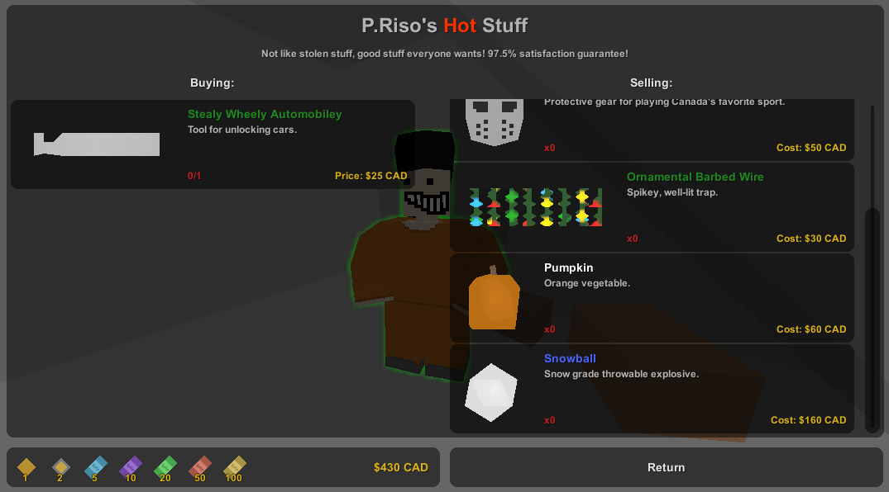

Currency
========

Any collection of items with different numeric values can be associated together in a __Currency__ asset. NPCs can then automatically convert between the different items, and vendor menus can display information using the linked currency. This is intended to be useful beyond real-world currencies, e.g. bartering ammunition.

Asset Setup
-----------

This is an [Asset v2](AssetsV2.md) class.

The currency asset defines how numbers are formatted, which items make up the currency, and their individual values. An example can be found at Bundles/Items/Supplies/CanadianCurrency.asset.

**ValueFormat** *string*: String to format numeric value into. For example "${0:N0} CAD" is the vanilla Canadian currency format.

**DefaultConditionFormat** *string*: If an NPC currency condition does not specify a formatting string this is used as the default. {0} is the total value held in the player's inventory, and {1} is the condition value. For example "${0:N0}/{1:N0} CAD" is the vanilla Canadian currency format.

__Entries__: Array of items in the currency. Each has an __Item__ GUID and __Value__ integer. Optionally __Is_Visible_In_Vendor_Menu__ bool can be false to hide the item from the NPC vendor currency list. For example these are the $10 and $20 notes in the Canadian currency:

	{
		"Item"
		{
			"GUID" "b6b87dfad5f342dc91bbb2de950f56ee"
		}
		"Value" "10"
	}
	{
		"Item"
		{
			"GUID" "3b9847bb328d445495b64be9e5ea9400"
		}
		"Value" "20"
	}

To link a vendor with a currency set the vendor asset's __Currency__ to the currency asset's GUID. Vendors display all of the items sorted from lowest to highest value.

NPC Logic
---------

Conditions can use the __Currency__ type to require different total amounts in the player's inventory. Rewards can use the __Currency__ type as well to grant amounts. Refer to [Conditions.md](/NPCAsset/Conditions.md) and [Rewards.md](/NPCAsset/Rewards.md) for documentation.

Testing
-------

The built-in "give" command accepts currency GUIDs as an alternative to item IDs. For example the following grants $1,000 CAD to the local player:

	/give 5150ca8f765d4a68bfe54912146da410/1000
