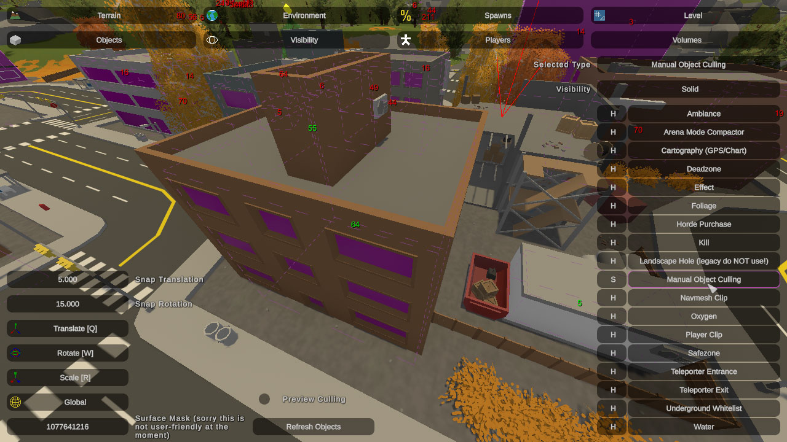

Manual Object Culling
=====================

This article is intended for map developers and explains **Manual Object Culling** volumes.

Drawing fewer objects is usually better for performance. Culling volumes allow you to override the distance at which the contained objects are drawn where otherwise they might be drawn much further away than necessary. For example, by default the vanilla chair models are visible from quite far away in case they are placed outdoors, whereas inside an office building they only need to be seen while near the building.

This comes with an obvious downside: when zooming in on most buildings it is readily apparent that the furniture is missing. I experimented with some workarounds like enabling objects near the center of your view while zoomed, but it did not feel any better. In my opinion the performance trade-off is worth it. "Large" objects like shipping containers that have higher gameplay importance as cover are excluded by default, and most buildings have their culling volumes inset from the edges slightly so that objects in the windows are excluded.

Editing volumes
---------------

You can enable the **Preview Culling** checkbox to hide all objects inside culling volumes. This is useful to find any objects that are not included when they should be. For example, while working on this update I realized the volumes in the vanilla cargo ships did not extend low enough to catch some of the furniture in the crew quarters. 

Objects inside volumes are found when loading the level. While working in the editor you can click **Refresh Objects** to re-find all objects/volumes on the map.

Updating the culling volumes costs some performance, so a large number of small volumes may actually make performance worse. It is worth comparing though.

Excluding specific objects
--------------------------

If you know your asset should never be managed by culling volumes you can add this line to the .dat file:

	Exclude_From_Culling_Volumes true

For example, the aerospace facility on Germany is excluded so that the manually placed culling volumes can hide large objects like shipping containers without accidentally hiding the giant structure. Note: volumes owned by objects automatically exclude their owner object.

Volumes owned by objects
------------------------

Most vanilla buildings come with default culling volumes which are not selectable because they are not saved in the level. These are the precursor to the manually placeable culling volumes, and have been invisibly hiding objects since 2014! Part of the goal with the culling volumes was to finally make these viewable in the editor because they have caused a lot of confusion over the years, especially for modded objects created without knowing they were there.

This is an area for future improvement, so I would not necessary recommend for/against adding them to your own objects. The following options are very old and poorly named, but can be specified in your object's .dat file to automatically create a culling volume:

**LOD** *enum*: Can be set to `Mesh` or `Area`. `Mesh` uses the bounds of renderers, and `Area` uses the size of Occlusion Area components. Note the Occlusion Area component's do not have any special functionality. At the time it was a workaround to allow placement in Unity with an otherwise unused component.

**LOD_Bias** *float*: Multiplier for the default 64m culling distance. For example, 2 would be visible up to 128m.

**LOD_Center_X, LOD_Center_Y, LOD_Center_Z** *float*: Offsets volume position relative to object transform along each axis.

**LOD_Size_X, LOD_Size_Y, LOD_Size_Z** *float*: Offsets calculated volume size in Mesh mode. Many vanilla buildings with flat rooftops use a negative Z offset to exclude HVAC units placed on the roof.

Testing culling volume performance benefit
------------------------------------------

If you would like to check whether culling volumes are providing any benefit you can run the game with the `-DisableCullingVolumes` launch option. Dense areas like Seattle tend to have the most noticeable difference.
