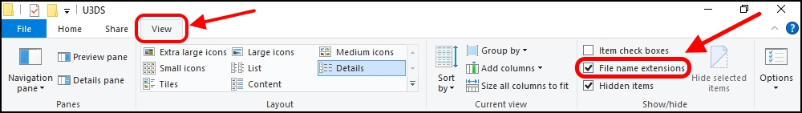
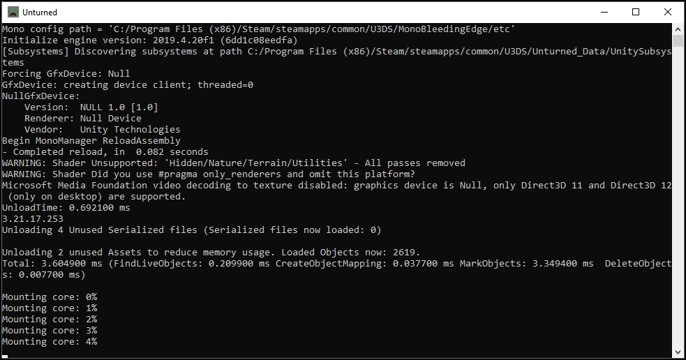

Server Hosting
==============

All multiplayer servers are hosted using the Unturned Dedicated Server tool (sometimes abbreviated to U3DS). This tool can either be installed and updated through your Steam Library, or it can managed through Valve's [SteamCMD](https://developer.valvesoftware.com/wiki/SteamCMD) tool. Using SteamCMD has several benefits, but is not strictly necessary. If you are not using SteamCMD, some of the documentation may not apply to you.

__Multiplatform:__
- [How to Configure Server](#How-to-Configure-Server)
- [How to Host Curated Maps](#How-to-Host-Curated-Maps)
- [How to Host Over Internet](#How-to-Host-Over-Internet)
- [Port Forwarding](PortForwarding.md)
- [Rocket](Rocket.md)
- [Login Tokens](GameServerLoginTokens.md)
- [Update Notifications](ServerUpdateNotifications.md)
- [Rules and Guidelines](ServerHostingRules.md)

__Windows:__
- [How to Install SteamCMD](#How-to-Install-SteamCMD-on-Windows)
- [How to Launch Server](#How-to-Launch-Server-on-Windows)
- [Video Tutorial](https://www.youtube.com/watch?v=8axVrnSLlx4)

__Linux:__
- [How to Install SteamCMD](#How-to-Install-SteamCMD-on-Linux)
- [How to Launch Server](#How-to-Launch-Server-on-Linux)

How to Install Server without Steam CMD
---------------------------------------

The Unturned Dedicated Server tool is bundled alongside the Unturned application, but it is considered its own application. The tool is installed and updated independently from the game itself.

When using the default application filters for the Steam Library, tools are not be visible. To install the tool from your Steam Library either search for "Unturned Dedicated Server" via the search filter, or enable the "Tools" application type filter so that tools are visible. Select the "Unturned Dedicated Server" application in your Steam Library, and click the "Install" button.

The tool and the server files are saved to the `...Steam\steamapps\common\U3DS directory`. When hosting multiple servers, it is ideal to install and update the Unturned Dedicated Server tool through Valve's [SteamCMD](https://developer.valvesoftware.com/wiki/SteamCMD) tool, instead of managing server tool through your Steam Library.

How to Install SteamCMD on Windows
----------------------------------

1. [Download From Here](https://steamcdn-a.akamaihd.net/client/installer/steamcmd.zip)
2. Extract the contents of the zip somewhere you can find it again.
3. Run `steamcmd.exe`

Continue to: [How to Install Server using SteamCMD](#How-to-Install-Server-using-SteamCMD)

How to Install SteamCMD on Linux
--------------------------------

Installation on Linux varies by distribution and your admin preferences, so refer to [Valve's Linux Documentation](https://developer.valvesoftware.com/wiki/SteamCMD#Linux). Once downloaded, run the `steamcmd.sh` script.

Continue to: [How to Install Server using SteamCMD](#How-to-Install-Server-using-SteamCMD)

How to Install Server using SteamCMD
------------------------------------

1. Login to Steam anonymously:

		login anonymous

2. Download the server:

		app_update 1110390

	_Note: this command can also be used to update the server._

3. Close SteamCMD:

		quit

4. The server files are now in the `...SteamCMD\steamapps\common\U3DS` directory.

Continue to: [How to Launch Server on Windows](#How-to-Launch-Server-on-Windows) or [How to Launch Server on Linux](#How-to-Launch-Server-on-Linux)

How to Launch Server on Windows
-------------------------------

1. Navigate to the `...\SteamCMD\steamapps\common\U3DS` directory.
2. Create a new text file by right-clicking an empty space within the U3DS directory, and selecting New > Text Document. This will create a new text file called "New Text Document.txt".
	1. **If the file name does not display the `.txt` file extension, then you need to enable the viewing of "File name extensions".**
	2. At the top of the File Explorer window, navigate to the View tab on the ribbon.
	3. In the Show/hide section of options, ensure that the "File name extensions" box is checked.
	
	4. File extensions should now be displayed at the end of file names.
3. Rename the "New Text Document.txt" file, and change it from a text file (.txt) to a batch script file (.bat). For example, "Tutorial.bat".
4. Right-click on the batch script (`Tutorial.bat`) and select Edit. This will open the batch file in your default text editor, although any text editor (e.g., Notepad, WordPad, Notepad++) can be used.
5. Add the script that will start your server when the batch script is ran.
	* For an internet server, copy-and-paste the following text into the file: `start "" "%~dp0ServerHelper.bat" +InternetServer/MyServer`
	* For a LAN server, copy-and-paste the following text into the file: `start "" "%~dp0ServerHelper.bat" +LanServer/MyServer`

	_Note: running an internet server will require opening ports on your router (this is called "port forwarding")._

	In this example "MyServer" is used as the ServerID for savedata and configuration purposes; you may choose to replace "MyServer" with a different name. For an example batch script, open the built-in `ExampleServer.bat` file in a text editor._

6. Save your changes to the file, and close the file.
7. Double-click the batch script to launch the server. A command-line interface should appear. Because this is the first time we have ran the batch file, it is going to generate a bunch of necessary server files.
	

8. When the command-line interface stops outputting new lines of text, it has finished loading (and finished generating all necessary files). You can safely close the server by executing (typing, and then pressing the "↵ Enter" key on your keyboard) the following command on the command-line interface: `shutdown`

9. The batch script has created a new file directory located in `...\U3DS\Servers`, called "MyServer". This directory is where all the savedata and configuration files are kept. Changing the `MyServer` ServerID (from step 5) in the batch script to a different name will allow for keeping savedata separate across multiple servers, and for running multiple servers at once.

10. (optional) For your server to be visible on the in-game internet server list you will need to set a [Login Token](GameServerLoginTokens.md) and configure [Port Forwarding](PortForwarding.md).

How to Launch Server on Linux
-----------------------------

1. Navigate to the `.../SteamCMD/steamapps/common\U3DS` directory.
2. To create our server, we need to execute a command.
	* For an internet server run the following command: `./ServerHelper.sh +InternetServer/MyServer`
	* For a LAN server run the following command: `./ServerHelper.sh +LanServer/MyServer`

	_Note: running an internet server will require opening ports on your router (this is called "port forwarding")._

	In this example "MyServer" is used as the ServerID for savedata and configuration purposes; you may choose to replace "MyServer" with a different name. For an example script, open the built-in `ExampleServer.sh` file in a text editor._

3. You can safely close the server by executing (typing, and then pressing the "↵ Enter" key on your keyboard) the following command on the command-line interface: `shutdown`

4. The executed command has created a new file directory located in .../U3DS/Servers, called "MyServer". This directory is where all the savedata and configuration files are kept. Changing the `MyServer` ServerID (from step 2) in the batch script to a different name will allow for keeping savedata separate across multiple servers, and for running multiple servers at once.

5. (optional) For your server to be visible on the in-game internet server list you will need to set a [Login Token](GameServerLoginTokens.md) and configure [Port Forwarding](PortForwarding.md).

How to Configure Server
-----------------------

Each individual ServerID has its own savedata and configuration.

1. Determine the ServerID. This is the name after the +InternetServer/ or +LanServer/ command.
2. Navigate to U3DS > Servers > ServerID.

Launch commands are setup in the Server > `Commands.dat` file. Each line should have one command.

Common useful commands are:

- __Map__: Specify the map to load by name, otherwise PEI is used.

	Examples:

		Map PEI
		Map Washington
		Map Russia

- __Port__: Running multiple servers simultaneously requires specifying different ports. Unturned uses two consecutive ports. The first is for server list queries, and the second for in-game traffic. Recommended port values are 27015 for the first server, 27017 for the second server, 27019 for the third server, so on and so forth.

	Examples:

		Port 27015
		Port 27017

- __Name__: Name of the server on the server list; set as "Unturned" by default.
- __Password__: Requires password to join server. Note that password is only SHA1 hashed, so don't use the same password anywhere else.
- __Perspective__: Can be set to "First", "Third", "Both", or "Vehicle" to change camera options.
- __Cheats__: Allows admins to invoke cheat commands like spawning items or vehicles from the chat.

Game rules, listing display, and many other options are available in the `Config.json` file. Game options mirror the in-game Play > Singleplayer > Config menu. This file deserves further documentation, but is not officially documented yet.

Steam Workshop add-ons (e.g., maps, items, vehicles) are setup in the `WorkshopDownloadConfig.json` file.
To include a Workshop file on your server:

1. Browse to its web page, for example: [Hawaii](https://steamcommunity.com/sharedfiles/filedetails/?id=1753134636)
2. Copy the file ID from the end of the URL.

		URL: https://steamcommunity.com/sharedfiles/filedetails/?id=1753134636
		ID: 1753134636

3. Insert the file ID into the File_IDs list:

		"File_IDs":
		[
			1753134636
		],

	Multiple file IDs should be separated by commas:

		"File_IDs":
		[
			1753134636,
			1702240229
		],

4. During startup the files will be updated, and any dependencies detected. Players will have the files downloaded while connecting to the server.

### How to Host Curated Maps

Curated maps are available as workshop items, so are configured in the `WorkshopDownloadConfig.json` file. During startup the Map command searches installed workshop items for a matching name.

Alphabetically sorted list of curated map file IDs:

- Athens Arena: 1454125991
- Arid: 2683620106
- Belgium: 1727125581
- Bunker Arena: 1257784170
- California: 1905768396
- Canyon Arena: 1850209768
- Carpat: 1497352180
- Cyprus Arena: 1647991167
- Cyprus Survival: 1647986053
- Dango: 1850228333
- Easter Island: 1983200271
- Elver: 2136497468
- France: 1975500516
- Greece: 1702240229
- Hawaii: 1753134636
- Ireland: 1411633953
- Kuwait: 2483365750
- Rio de Janeiro: 1821848824

How to Host Over Internet
-------------------------

Hosting a publicly-accessible internet server requires an extra step compared to a LAN server. When on a home network [Port Forwarding](PortForwarding.md) is required in order to direct traffic to the host computer.

One way to think of it is that when there are multiple devices (e.g. computers and phones) connected to the LAN, the outside internet does not know which device is the Unturned server. In this case port forwarding specifies which LAN device is the host.

For port ranges and other details: [Port Forwarding](PortForwarding.md)

Listing your server on the in-game internet server list requires a [Login Token](GameServerLoginTokens.md) to be set.
