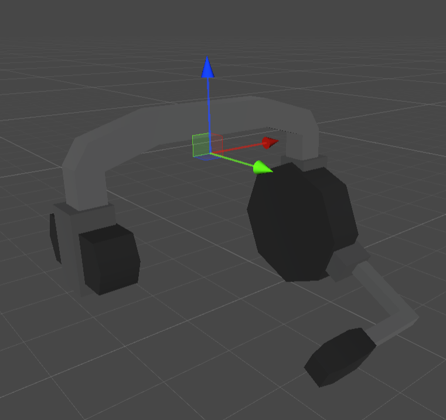
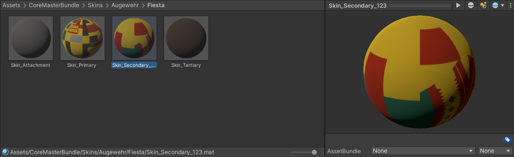

.. _doc_curated_skins:

Curated Items
=============

Community-created items (such as skins, cosmetics, and mythical effects) can be submitted to the :ref:`doc_steam_workshop` for consideration to be incorporated into the actual game. These items can be found under the `Stockpile Submissions <https://steamcommunity.com/workshop/browse/?appid=304930&section=mtxitems>`_ tab, where other players can vote on whether they would like to see a specific submission added into the game.

Accepted items may be made available for purchase, or otherwise be unlockable within the game. Most accepted items are sold in the `Stockpile <https://store.steampowered.com/itemstore/304930/>`_ (also known as the item store).

The default revenue share is 25%, but for items associated with maps (e.g., the `Elver Map Bundle <https://store.steampowered.com/itemstore/304930/detail/1103/>`_) the revenue share is 50%. Your own split of that revenue share may be lower when an item has multiple contributors – such as when your item was created by multiple people, or if your item is added as part of bundle that contains many different peoples' items.

Requirements
------------


For the tools necessary to start creating skins or cosmetics, refer to the :ref:`doc_getting_started` page. Some additional preparation is needed compared to creating mods:

#. Follow the submission guidelines.
#. Organize your Unity project.
#. Create your cosmetic or skin.
#. Specify a Mythical effect placement (if your item is a cosmetic).
#. Export a Unity package.
#. Submit your item to the :ref:`doc_steam_workshop`.

Guidelines
----------


Most of these guidelines are intended to help promote consistency with *Unturned*'s art style. Here are the guidelines you should keep in mind:

#. | Avoid high contrast colors. They're often painful to look at, especially when the item appears in harsh lighting.

#. | Do not go darker than |ico1| #1e1e1e or brighter than |ico2| #f0f0f0. Both extremes of brightness (and fully saturated colors) don't play nicely with the game's lighting. Most official content uses medium-intensity colors.

#. | Edges of clothing should have a slightly darker border that is one pixel wide. This can be easily seen on official clothing items, along the cuffs and bottom hem of shirts.

#. | Flat textures meant to blend into the terrain (e.g., similar to the in-game ghillie suit) should not be used. Instead, you can incorporated patterned camouflage into your items.

#. | Textures should be kept to a reasonable resolution. Ideally, 2048x2048 scaled down to 1024x1024 for large items (e.g., the Maplestrike), and 1024x1024 scaled down to 512x512 for small items (e.g., the Cobra).

#. | Corners of models should not be beveled. Most models have sharp edges (e.g., 90°). There is not a hard limit on vertex, triangle, or polygon count because anything matching the game's art style will naturally have a reasonable number.

#. | Skins with custom models should generally respect the original item's silhouette. Be mindful that attachments (such as barrels, tacticals, sights, and grips) should still work on the custom model *and* look good.

#. | Cosmetics should avoid potentially confusing players. This can seem broad, but what we tend to look at is: (1) if it doesn't look like the player is wearing an item (e.g., a hat that looks like hair with no additional details), or (2) if it looks like end-game loot (often, this means military-grade equipment).

#. | Only use copyrighted content, trademarks, or other intellectual property that belongs to you. We cannot put other people's intellectual property into our game.

Remember: these are just guidelines. Except in specific cases (such as copyright infringement), we may occasionally accept items that break some of these guidelines. However, these are the things we are looking for in submissions. Sticking to these guidelines will help your chances of getting your item accepted.

Unity Project Organization
--------------------------

Organizing your project into two separate folders: one for your exported asset-bundled files (e.g., an ``Item.prefab``) and one for your imported sources (e.g., a ``.blend`` file) is greatly appreciated. This makes it much easier for us to ensure only the necessary assets are included in the game.

For reference: all of the base game's asset-bundled files are in the ``Assets/CoreMasterBundle`` folder, and all of the source files are in the ``Assets/Game/Sources`` folder.

Cosmetics
`````````

Some additional notes exist for organizing cosmetic items.

- | Map-related cosmetics are in per-map folders, and prefixed with the map's name. For example, Arid's "`Arrowhead <https://unturned.wiki.gg/wiki/Arrowhead>`_" exported files are located in ``Assets/CoreMasterBundle/Items/Arid/Arid_Arrowhead`` and the source files are in ``Assets/Game/Sources/Items/Arid``.
- | Outfits have their items in a per-outfit folder, and are prefixed with the outfit name. For example, the "`Cultist's Mask <https://unturned.wiki.gg/wiki/Cultist%27s_Mask>`_" exported files are in a per-outfit folder and prefixed with the outfit name. For example, the Cultist bundle's mask item export files are located in ``Assets/CoreMasterBundle/Items/Outfits/Cultist/Cultist_Mask`` and the source files are in ``Assets/Game/Sources/Items/Outfits/Cultist``.
- | Miscellaneous items are in the folder matching their type. For example, the "`Backpack Turtle <https://unturned.wiki.gg/wiki/Backpack_Turtle>`_" exported files are located in ``Assets/CoreMasterBundle/Items/Backpacks/Turtle_Backpack`` and the source files are in ``Assets/Game/Sources/Items/Backpacks/Turtle_Backpack``.

Exporting Unity Package
-----------------------

Since the assets for accepted cosmetics are included in the game's core asset bundle, a ``.unitypackage`` file is required along with the regular ``.dat`` files for items. To export the package:

#. Select the folders containing your ``Item.prefab`` files (or equivalent asset-bundled files for other types of items). For example, if we were submitting our official Fedora item then we would select the ``Assets/CoreMasterBundle/Items/Hats/Fedora`` folder.
#. Right-click in the **Project** window.
#. Click **Export Package...**.
#. Ensure **Include dependencies** is checked to include the source files that aren't directly placed in the asset bundles (i.e., the meshes, materials, textures, etc.).

.. note::

	The Unity package is in *addition* to the regular asset ``.dat`` and ``English.dat`` files required for items to work. Including the ``.dat`` files from your setup is useful for keeping the accepted version consistent. While not strictly necessary, including a name and description in the English text file is appreciated and will probably be used.

Creating Cosmetics
------------------

In terms of setup, cosmetics are identical to actual in-game clothing items. The main difference between cosmetics and clothing is that the former does not offer any benefits to the player, appear over most worn clothing items, and can have their visibility toggled at will by the player.

Since these are otherwise identical, we recommend referencing the clothing items included in the ExampleAssets.unitypackage in order to create your cosmetic items.

Mythical Effect Placement
`````````````````````````



	Example "Effect" transform positioning and orientation.

Most cosmetic items will want to support mythical effects. For your item to support this, the Item.prefab will need to include an "Effect" child transform. The orientation is rather unfortunate: +Z is the mythical's up direction and +Y is the mythical's forward direction.

Creating Skins
--------------

Any item in *Unturned* could support skins, but not every item does at this time. We recommend only creating skins for items that are already skinnable. This includes most weapons, along with a few miscellaneous items such as Canned Beans and the Detonator. The unwrapped meshes are included as part of the ExampleAssets.unitypackage.

At the very least, you will want to create a custom albedo for your skin. You can also add custom metallic or emission textures. When eventually uploading your skin to the Steam Workshop, please make sure you follow the "Exporting Unity Package" steps to include your source files! This allows us to add any extra needed assets, or fix minor issues.



	The Fiesta Augewehr skin includes all four types of materials.

Unless your skin includes a custom mesh (as detailed in a later section), your asset-bundled files will not include a prefab. Instead, skins will include the material(s) used by the item and any attachments attached to it.

- | **Primary**: The ``Skin_Primary.mat`` is the material used by the skinned item itself. Every skin should have a single primary material.
- | **Secondary**: Each ``Skin_Secondary_#.mat`` included in the bundle files is for a specific attachment (where the ``#`` is the attachment's legacy ID). Skins can have multiple secondary materials. When creating skins for sniper rifles, you will usually want to include at least one secondary material for a scope.
- | **Attachment**: The ``Skin_Attachment.mat`` (also called the "layered attachments material") is used when a secondary material has not been provided for an attachment that has texture masks. For example, the 8x Scope has its mount and knobs masked out.
- | **Tertiary**: The ``Skin_Tertiary.mat`` (also called the "fallback attachments materials") is used when none of the other included materials are applicable for an attached attachment. You will usually want to include a tertiary material if your skin has an attachments material.

.. figure:: /assets/img/FallbackLayered.png

	Notice how some parts of the 8x Scope retains some of its original texture when a Layered Attachments material is included, while the Fallback Attachments material completely covers it.

Although most skins keep their layered (Skin_Attachment.mat) and fallback (Skin_Tertiary.mat) textures identical, this is not required. Some skins have fairly different secondary, attachment, and tertiary materials. The Bloodsport Calling Card, Bouquet Bluntforce, and Vortex Augewehr are good examples of this.

Custom Models
`````````````

Skins can override an item's original model with a custom one. If you create a skin that does this, it's more likely to be accepted if your custom model still respects the original silhouette of the item. By extension, things like attachments and stat counters should still look good when attached to the item.

Setting this up in Unity is simple. Your asset-bundled files should include a ``Override_Mesh_#.prefab`` (where ``#`` is the LOD's index). For example, ``Override_Mesh_0.prefab``. This prefab simply includes a Mesh Filter component that is linked to your custom model.

Using Collections
-----------------

Collections allow for grouping multiple item submissions together, making it easier for users to discover and rate similar content when browsing the Steam Workshop. Creators often use collections to group skins that all share a similar pattern together.

Some creators may create collections when they want to showcase different versions of their item (e.g., palette swaps). While these *could* be combined into a single submission, having them separate allows for players to vote on the specific version(s) they would like to see accepted into the game.

Another way of using collections is to organize submissions that were designed to be used together. For example, a bunch of individual cosmetic items that would form a complete outfit. Creating a collection that contains each individual item allows players to vote on the specific item(s) they would like to see, and makes it easier for us to accept only a couple pieces from an outfit (e.g., when choosing items for a new box). You may also consider using an :ref:`OutfitAsset <doc_assets_outfit>` to create a preview image that can be used on the Workshop page for the outfit's collection or its related items.
