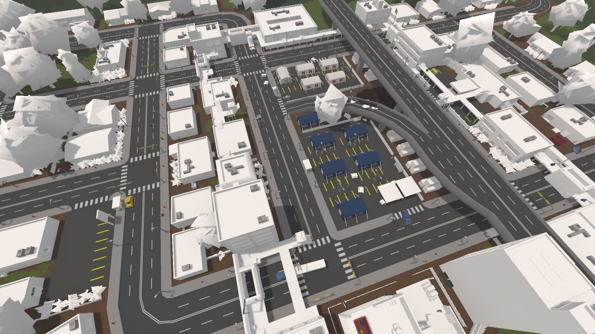

Level Batching
==============

This article is intended for map developers and explains how to maximize draw call batching.

For background information on the purpose of batching:

- `Optimizing draw calls (Unity docs) <https://docs.unity3d.com/Manual/optimizing-draw-calls.html>`_
- `Texture atlas (Wikipedia) <https://en.wikipedia.org/wiki/Texture_atlas>`_
- `Static batching (Unity docs) <https://docs.unity3d.com/Manual/static-batching.html>`_

Enabling batching in your level
-------------------------------

By default batching is disabled because some parts of the level may be incompatible (causing graphical bugs), the texture atlas might be too big, it might worsen performance, etc. Publishing your map with batching enabled is only recommended after double-checking each location in singleplayer. (batching is disabled in the level editor) You can test it by adding this property to your level's ``Config.json`` file:

.. code-block:: json

	"Batching_Version": 2

The purpose of the version number is to allow future improvements without potentially breaking existing maps. For example, if atlas generation is supported for more shaders in an update it might behave unexpectedly, so those shaders would be excluded on older versions.

Purpose of atlas generation
---------------------------

Using fewer unique materials is almost always better for performance. Combining materials which only differ in their texture allows them to benefit from static and dynamic batching. If you want you can manually create a texture atlas for your own meshes, but resizing requires updating all your mesh UVs, and is generally a hassle. Considering that most workshop maps use objects from a variety of different mod packs, atlas generation helps them all work together.

Materials eligible for atlas inclusion
--------------------------------------

Standard (Decalable) or Standard (Specular setup) (Decalable):

- Mode is Opaque
- Texture is unset, or is 128x128 or smaller with Clamp wrap mode
- All other material features are default

Custom/Card: supported for the automatically generated tree skybox models.

Custom/Foliage: default trees/bushes.

Excluding specific objects and resources from batching
------------------------------------------------------

If you know your asset is incompatible you can add this line to the .dat file:

.. code-block:: cs

	Exclude_From_Level_Batching true

NPCs, decals, and speedtrees (when enabled) are excluded by default. This option may be useful for elaborate setups using Unity Event components. For example if an event moves the renderer transform or sets material parameters.

Finding renderers that could benefit from atlas inclusion
---------------------------------------------------------

By default the game considers every renderer in objects and resources. You can enable logging for why each renderer is excluded with the ``-LogLevelBatchingTextureAtlasExclusions`` launch option. Inclusion in the atlas is beneficial to merge as many meshes as possible into as few static batches as possible, but ineligible renderers will use static batching regardless.

None of the messages logged are "errors" per se. It only explains why the game cannot (yet) atlas them. The most useful message for finding assets to modify is "Wrap Mode is not Clamp" because if the mesh does not require UVs outside the 0-1 square it can use ``Clamp`` wrap mode.

Validating UVs
--------------

When textures are merged into an atlas any meshes referencing them need their UV coordinates updated. If any UVs are outside the 0-1 square they will now be overlapping a completely different texture and appear incorrectly. You can use the ``-ValidateLevelBatchingUVs`` launch option to log any batched meshes with out-of-bounds UVs. For example this error with the vanilla chess board::

	Mesh "Model_0" in renderer "Chess_0/Model_0" has UVs outside [0, 1] range (should be excluded from level batching)

In the case of the chess board it was a mistake in the unwrapping which was then fixed, but in most cases this would suggest the mesh relies on ``Wrap Mode`` being ``Repeat``.

Previewing renderers using atlas
--------------------------------

You can visualize which renderers have been included in the texture atlas by loading singleplayer with the ``-PreviewLevelBatchingTextureAtlas`` launch option:

	Berlin with texture atlas preview enabled.

All renderers in white were merged into a single material per shader. It is not necessarily bad that some materials were not merged. For example, the HVAC units on the rooftops in the screenshot all share a material already, so they are able to use static batching together. The same goes for the roads and overpass.
