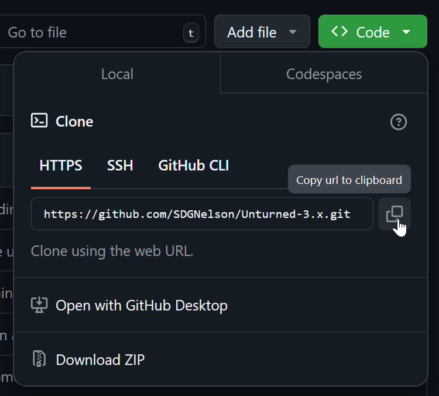
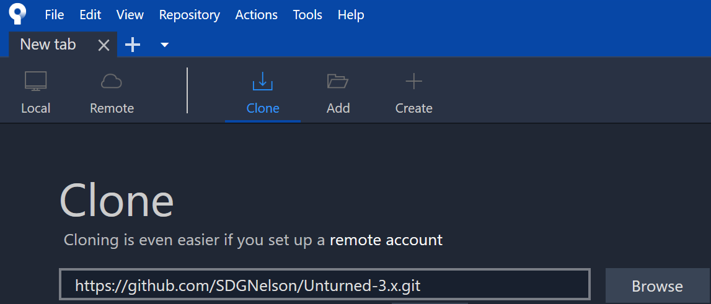
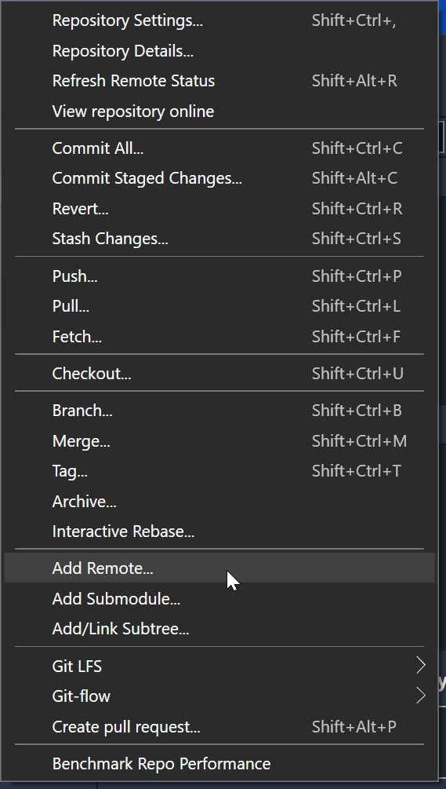

.. _doc_using_git:

Using Git
=========

First time setup:

#. Fork
#. Clone
#. Add Upstream

Development loop:

#. Branch
#. Commit and Push (repeat)
#. Sync with Upstream
#. Pull Request

GitHub offers a `more thorough walkthrough to forking, cloning, and syncing changes <https://docs.github.com/en/pull-requests/collaborating-with-pull-requests/working-with-forks/fork-a-repo>`_.

Fork
----

The first step is to "fork" the game. This creates your own personal copy to develop and experiment with.

Visit the game repository, click the down arrow next to "Fork", and select "Create a new fork."

Clone
-----

You can use the Git CLI to clone (download) the files, but we recommend using a GUI. The Git website `lists a variety of great, free GUI tools <https://git-scm.com/downloads/guis>`_ including `GitHub Desktop <https://github.com/apps/desktop>`_ and `Sourcetree <https://www.sourcetreeapp.com/>`_. Nelson uses `Fork <https://git-fork.com/>`_, however it has an upfront price of $60 USD at the time of writing (2025-02-25).

From your forked repository, click the **Code** button to get the link:

Clone a local copy of your forked repository (in Sourcetree in this example):

Branch
------

Create a branch for your custom changes. You'll periodically **commit** changes to your branch. For example, if working on a big crafting balance overhaul you might create a branch named ``dev-crafting-balance``.

Commit
------

Commits save a selection of your changes. Commit often! Don't be afraid to commit. For example, you might commit "Added stacked logs barricade" or "Fixed gap in potato item model".

It's especially useful if (when) something goes wrong. For example, if a change you were testing turns out to be a bad idea, it's easy to roll back to the previous commit.

Add Upstream
------------

To enable you to keep your forked repository up-to-date, the next step is to add the base game repo as another **Remote** (server).

There should be an option to **Add Remote** (in Sourcetree in this example):

Set the remote name to ``upstream``. It can technically be anything, but upstream is the conventional name.

For the remote URL use the ``.git`` URL from the base game's **Code** dropdown in the GitHub web GUI.

Syncing with Upstream
---------------------

GitHub has a `more detailed article about this <https://docs.github.com/en/pull-requests/collaborating-with-pull-requests/working-with-forks/syncing-a-fork>`_.

Your fork doesn't automatically stay up-to-date with changes in the base game. It's important to sync up occasionally, or before submitting a pull request.

#. **Fetch** news from all remotes. This updates the changes your local copy knows about.
#. **Checkout** the ``main`` branch locally. (Switching away from your custom branch.)
#. **Pull** changes from ``upstream/main`` into your local ``main``.
#. **Checkout** your custom branch.
#. **Merge** the ``main`` branch into your custom branch. This may require resolving merge conflicts.

.. note:: This can be done in a quicker, more straightforward fashion, but this guide doesn't want to risk clobbering your changes.

Push
----

Pushing your changes uploads them to GitHub. By pushing occasionally you gain the added benefit of an online backup of your work!

Pull Request
------------

GitHub again has an `article about pull requests <https://docs.github.com/en/pull-requests/collaborating-with-pull-requests/proposing-changes-to-your-work-with-pull-requests/creating-a-pull-request>`_.

Create a pull request to ask for your changes to be added to the base game. From your fork's repository in GitHub's web GUI there should be a button to **Compare & pull request**.

Font Atlases Dirty
------------------

It's possible for characters not included in the font atlases to show up while playing in Unity. For example, from workshop files on the main menu or signs in multiplayer. These get added to the fallback font atlases, marking them changed in git. There's probably a better way to work around this, but one way is to tell git not to detect them as changed:

``git update-index --skip-worktree "Assets/Resources/UI/Glazier_uGUI/LiberationSans Fallback.asset" "Assets/Resources/UI/Glazier_uGUI/NotoSansCJK Fallback.asset"``

To undo this (for example, when needing to discard changes):

``git update-index --no-skip-worktree "Assets/Resources/UI/Glazier_uGUI/LiberationSans Fallback.asset" "Assets/Resources/UI/Glazier_uGUI/NotoSansCJK Fallback.asset"``

Clarifying Git vs GitHub
------------------------

It's a common misconception that `Git <https://git-scm.com/>`_ and `GitHub <https://en.wikipedia.org/wiki/GitHub>`_ are the same thing! Git is the underlying version control system (`VCS <https://en.wikipedia.org/wiki/Version_control>`_). GitHub is a `software forge <https://en.wikipedia.org/wiki/Forge_(software)>`_ which hosts Git services.
